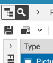
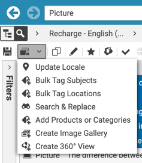
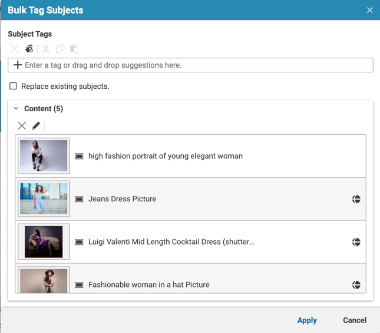
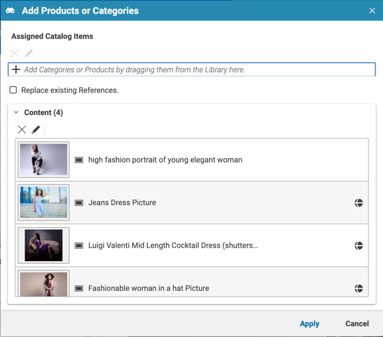
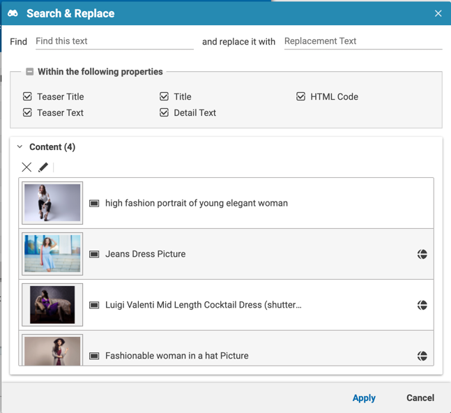
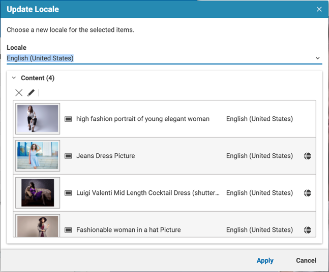

# Bulk Operations

This extension allows you to configure and define bulk operations for content. Let me give you some examples:
* You have a list of items that you want to tag
* You want to bulk update the locale of a list of items

### Examples

This extensions adds a litte button to your Studio Library





#### Bulk Tagging
The following bulk tagging actions are available
* Bulk Tagging for Tags
* Bulk Tagging for Locations
* Bulk Tagging for Assets



#### Bulk Assigning Product References
This action allows you to easily add a list of commerce items to e.g. Images


#### Search & Replace
This action allows you to search & replace a text


#### Bulk Update Locale
This action allows you to bulk update the locale of a list of content items


### Installation

- From the project's root folder, clone this repository as a submodule of the extensions folder. Make sure to use the branch name that matches your workspace version.
```
git submodule add https://github.com/coremedia-contributions/bulk-operations modules/extensions/bulk-operations
```

- Use the extension tool in the root folder of the project to link the modules to your workspace.
 ```
mvn extensions:sync -f workspace-configuration/extensions -Denable=bulk-operations
```
